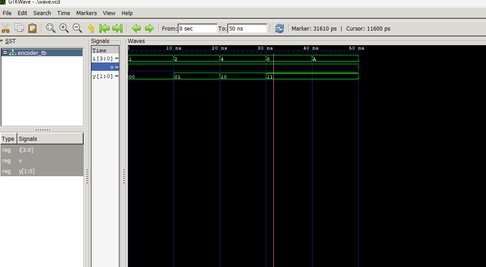

# 🧪 Lab 3: Design and Simulation of Encoder and Decoder using VHDL

## 🎯 Objective

- To design and implement a **4-to-2 Priority Encoder** using VHDL.
- To design and implement a **2-to-4 Decoder** using VHDL.
- To verify the functionality of both circuits through simulation waveforms.

---

## 📖 Introduction

Combinational circuits are digital circuits whose outputs depend only on the present input values. Encoders and decoders are important combinational logic circuits widely used in digital systems, communication systems, memory devices, and microprocessor-based applications.

This lab demonstrates the design and simulation of a **4-to-2 Priority Encoder** and a **2-to-4 Decoder** using VHDL.

---

## 🔹 4-to-2 Priority Encoder

A priority encoder converts multiple input lines into a smaller binary code while assigning priority to the highest-order active input. If more than one input is active simultaneously, the encoder produces the binary code corresponding to the input with the highest priority.

### Truth Table

| I3 | I2 | I1 | I0 | Y1 | Y0 |
|----|----|----|----|----|----|
| 0 | 0 | 0 | 1 | 0 | 0 |
| 0 | 0 | 1 | X | 0 | 1 |
| 0 | 1 | X | X | 1 | 0 |
| 1 | X | X | X | 1 | 1 |

Where:
- **I3** has the highest priority.
- **Y1Y0** represents the encoded binary output.

---

## 🔹 2-to-4 Decoder

A decoder converts a binary input into one of several output lines. A 2-to-4 decoder accepts a 2-bit input and activates only one of the four output lines corresponding to the input combination.

### Truth Table

| A1 | A0 | Y3 | Y2 | Y1 | Y0 |
|----|----|----|----|----|----|
| 0 | 0 | 0 | 0 | 0 | 1 |
| 0 | 1 | 0 | 0 | 1 | 0 |
| 1 | 0 | 0 | 1 | 0 | 0 |
| 1 | 1 | 1 | 0 | 0 | 0 |

---

## ⚙️ Software and Tools Used

- VHDL
- GHDL Simulator
- GTKWave
- Visual Studio Code

---

## 📝 Procedure

1. Write the VHDL code for the 4-to-2 priority encoder.
2. Write the VHDL code for the 2-to-4 decoder.
3. Create testbenches to generate input combinations.
4. Compile the design files and testbenches using GHDL.
5. Run the simulation and generate waveform files.
6. Open the waveform files in GTKWave for verification.
7. Compare the simulation results with the truth tables.

---

## 📊 Simulation Results

### Encoder Output Waveform &  Decoder Output Waveform

---

## 💬 Discussion

- The priority encoder successfully generated binary codes corresponding to the highest-priority active input.
- The decoder activated only one output line for each input combination.
- Simulation results matched the expected truth tables.
- The waveform analysis confirmed the correct operation of both combinational circuits.
- Encoders and decoders are essential building blocks in digital electronics and computer systems.

---

## ✅ Conclusion

The 4-to-2 Priority Encoder and 2-to-4 Decoder were successfully designed and simulated using VHDL. The simulation waveforms verified the correctness of the designs according to their respective truth tables. This experiment helped in understanding the practical implementation and behavior of combinational logic circuits using hardware description languages.

---
