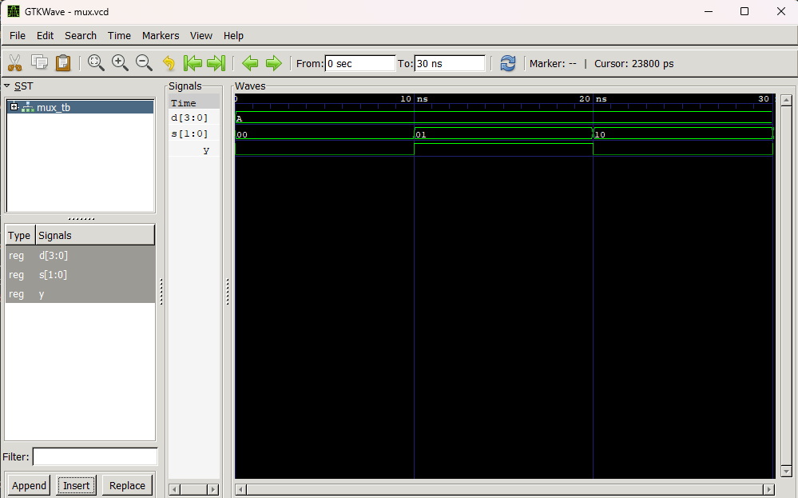

# Lab 4: VHDL Implementation of Multiplexer and Demultiplexer

## Objective

The objective of this lab is to design and simulate combinational data selection circuits using VHDL.

The main objectives are:

* To design and implement a **4-to-1 Multiplexer** using VHDL
* To design and implement a **1-to-4 Demultiplexer** using VHDL
* To create testbenches for both circuits
* To simulate the designs using GHDL
* To verify the output waveforms using GTKWave

---

## Files Included

| File Name        | Description                                |
| ---------------- | ------------------------------------------ |
| `mux_4to1.vhd`   | VHDL design file for 4-to-1 Multiplexer    |
| `mux_tb.vhd`     | Testbench file for Multiplexer             |
| `mux.vcd`        | Simulation waveform file for Multiplexer   |
| `demux_1to4.vhd` | VHDL design file for 1-to-4 Demultiplexer  |
| `demux_tb.vhd`   | Testbench file for Demultiplexer           |
| `demux.vcd`      | Simulation waveform file for Demultiplexer |
| `image.png`      | Output waveform screenshot                 |
| `README.md`      | Final lab report                           |

---

## Theory

Multiplexers and demultiplexers are important combinational circuits used in digital systems. They are mainly used for data selection, data routing, communication systems, memory circuits, and processor design.

A **multiplexer** selects one input from many inputs and sends it to a single output. A **demultiplexer** performs the reverse operation by taking one input and sending it to one of many outputs.

Both circuits operate based on select lines.

---

## 4-to-1 Multiplexer

A multiplexer, also called a **MUX**, is a combinational circuit that selects one input from multiple input lines and forwards it to one output line.

A **4-to-1 Multiplexer** has:

* 4 data inputs: `D0`, `D1`, `D2`, `D3`
* 2 select lines: `S1`, `S0`
* 1 output: `Y`

The output depends on the value of the select lines.

### Truth Table of 4-to-1 Multiplexer

| S1 | S0 | Output |
| -- | -- | ------ |
| 0  | 0  | D0     |
| 0  | 1  | D1     |
| 1  | 0  | D2     |
| 1  | 1  | D3     |

When the select lines are `00`, input `D0` is selected. Similarly, when the select lines are `11`, input `D3` is selected.

---

## 1-to-4 Demultiplexer

A demultiplexer, also called a **DEMUX**, performs the opposite operation of a multiplexer. It takes one input and routes it to one of many output lines based on the select lines.

A **1-to-4 Demultiplexer** has:

* 1 data input: `D`
* 2 select lines: `S1`, `S0`
* 4 outputs: `Y0`, `Y1`, `Y2`, `Y3`

Only one output line becomes active at a time depending on the select input combination.

### Truth Table of 1-to-4 Demultiplexer

| S1 | S0 | Y0 | Y1 | Y2 | Y3 |
| -- | -- | -- | -- | -- | -- |
| 0  | 0  | D  | 0  | 0  | 0  |
| 0  | 1  | 0  | D  | 0  | 0  |
| 1  | 0  | 0  | 0  | D  | 0  |
| 1  | 1  | 0  | 0  | 0  | D  |

---

## Software and Tools Used

| Tool    | Purpose                           |
| ------- | --------------------------------- |
| VHDL    | Hardware description language     |
| VS Code | Code editing                      |
| GHDL    | VHDL compilation and simulation   |
| GTKWave | Waveform viewing and verification |

---

## Implementation

The multiplexer and demultiplexer were implemented in separate VHDL design files.

The `mux_4to1.vhd` file contains the VHDL code for the 4-to-1 Multiplexer. The `demux_1to4.vhd` file contains the VHDL code for the 1-to-4 Demultiplexer.

Separate testbench files were created for both circuits. The testbenches applied different select line combinations and input values to verify whether the outputs changed according to the truth tables.

---

## Simulation Procedure

The simulation was performed using the following steps:

1. Write the VHDL code for the 4-to-1 Multiplexer.
2. Write the VHDL code for the 1-to-4 Demultiplexer.
3. Create separate testbenches for MUX and DEMUX.
4. Compile the design and testbench files using GHDL.
5. Run the simulations and generate `.vcd` waveform files.
6. Open the waveform files in GTKWave.
7. Compare the waveform results with the truth tables.

---

## Commands Used

### Multiplexer Simulation

```bash
ghdl -a mux_4to1.vhd
ghdl -a mux_tb.vhd
ghdl -e mux_tb
ghdl -r mux_tb --vcd=mux.vcd
gtkwave mux.vcd
```

### Demultiplexer Simulation

```bash
ghdl -a demux_1to4.vhd
ghdl -a demux_tb.vhd
ghdl -e demux_tb
ghdl -r demux_tb --vcd=demux.vcd
gtkwave demux.vcd
```

---

## Output

The simulation waveform generated using GTKWave is shown below:




The waveform shows the input, select lines, and output behavior of the multiplexer and demultiplexer circuits.

---

## Observations

From the simulation waveform, the following observations were made:

* The 4-to-1 Multiplexer selected the correct input according to the select line combination.
* When `S1S0 = 00`, input `D0` was passed to the output.
* When `S1S0 = 01`, input `D1` was passed to the output.
* When `S1S0 = 10`, input `D2` was passed to the output.
* When `S1S0 = 11`, input `D3` was passed to the output.
* The 1-to-4 Demultiplexer routed the input signal to the correct output line.
* Only one demultiplexer output was active for each select line combination.
* The waveform results matched the expected truth tables.

---

## Discussion

This lab helped in understanding the practical working of multiplexers and demultiplexers. The multiplexer demonstrated how one input can be selected from multiple input lines using select signals. This type of circuit is useful in data selection and communication systems.

The demultiplexer demonstrated the reverse process, where one input signal is routed to one of several output lines. This is useful in data distribution and signal routing applications.

Using VHDL made the circuit design clear and easy to simulate. The testbenches helped apply different input and select line combinations automatically. GTKWave was used to observe signal changes visually and verify the correctness of the circuits.

By comparing the waveform outputs with the truth tables, the correct operation of both circuits was confirmed.

---

## Conclusion

The 4-to-1 Multiplexer and 1-to-4 Demultiplexer were successfully designed and simulated using VHDL.

The simulation results verified that the multiplexer correctly selected one input based on the select lines, and the demultiplexer correctly routed one input to the proper output line.

Overall, this lab improved understanding of data selection, data routing, combinational circuit design, VHDL coding, testbench creation, and waveform-based verification.

---

## Repository Structure

```text
Lab4/
├── README.md
├── demux.vcd
├── demux_1to4.vhd
├── demux_tb.vhd
├── image.png
├── mux.vcd
├── mux_4to1.vhd
└── mux_tb.vhd
```
