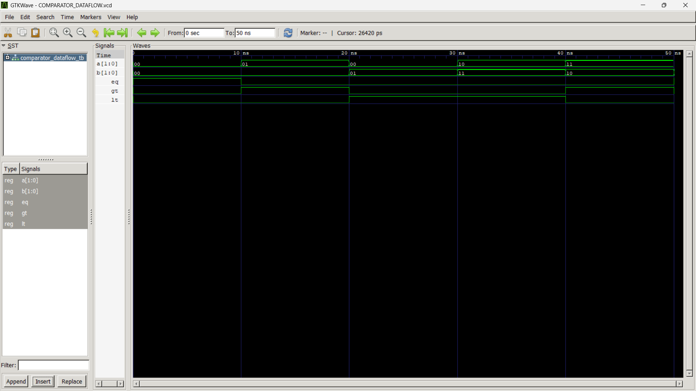

# Lab 5: 2-Bit Comparator in VHDL

## Objective

To design and simulate a 2-bit comparator using VHDL and verify its operation using GHDL and GTKWave.

---

## Programs Included

### 1. Behavioral Modeling (Using IF-ELSE)

**Files**

* COMPARATOR_2BIT.vhd
* COMPARATOR_TB.vhd

### Behavioral Waveform

---

### 2. Dataflow Modeling (Using Logic Expressions)

**Files**

* COMPARATOR_DATAFLOW.vhd
* COMPARATOR_DATAFLOW_TB.vhd

### Dataflow Waveform

---

## Truth Table

| A  | B  | EQ | GT | LT |
| -- | -- | -- | -- | -- |
| 00 | 00 | 1  | 0  | 0  |
| 01 | 00 | 0  | 1  | 0  |
| 00 | 01 | 0  | 0  | 1  |
| 10 | 11 | 0  | 0  | 1  |
| 11 | 10 | 0  | 1  | 0  |
| 11 | 11 | 1  | 0  | 0  |

---

## Result

The 2-bit comparator was successfully implemented using both Behavioral and Dataflow modeling approaches. The waveform outputs verified the correct operation of EQ, GT, and LT signals for all test cases.
