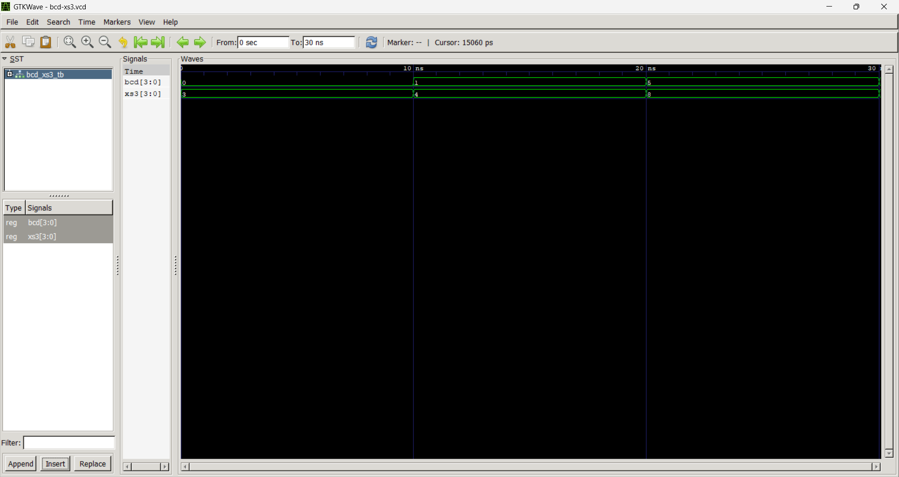
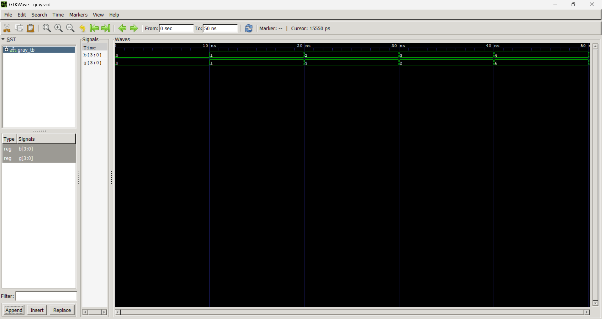

# Lab 6: VHDL Code for Combinational Circuits – Code Converter

## Objective
- To design and simulate a **BCD-to-Excess-3 code converter** in VHDL.  
- To design and simulate a **Binary-to-Gray code converter** in VHDL.  

## Theory

### BCD to Excess-3
- **Excess-3 (XS-3)** is a non-weighted BCD code obtained by adding `3 (0011)` to each BCD digit.  
- It is **self-complementing**, making it useful in arithmetic circuits.  

**Conversion Table:**

| Decimal | BCD (DCBA) | Excess-3 (WXYZ) |
|---------|------------|-----------------|
| 0       | 0000       | 0011            |
| 1       | 0001       | 0100            |
| 2       | 0010       | 0101            |
| 3       | 0011       | 0110            |
| 4       | 0100       | 0111            |
| 5       | 0101       | 1000            |
| 6       | 0110       | 1001            |
| 7       | 0111       | 1010            |
| 8       | 1000       | 1011            |
| 9       | 1001       | 1100            |

### Binary to Gray Code
- **Gray code** is a binary numeral system where two successive values differ by only one bit.  
- It is widely used in **rotary encoders** and for **error minimization** in digital systems.  
- Conversion rule:  
  - \( G_i = B_i \oplus B_{i+1} \)  
  - MSB of Gray = MSB of Binary  

## Output

**BCD to Excess3**

**Binary to Gray**

## Discussion
- The **BCD-to-Excess-3 converter** successfully adds `3` to each valid BCD digit, producing outputs in the range `0011–1100`.  
- Invalid BCD inputs (`1010–1111`) are not handled in this simple design but can be flagged as errors if needed.  
- The **Binary-to-Gray converter** ensures that only one bit changes between successive codes, reducing the chance of errors in digital communication and mechanical systems.  
- Simulation results confirm that both converters work correctly for their respective input ranges.  

---

## Conclusion
- The experiment demonstrates the design of **combinational code converters** using VHDL.  
- The **BCD-to-Excess-3 converter** is useful in arithmetic circuits due to its self-complementing property.  
- The **Binary-to-Gray converter** is essential in applications requiring error minimization, such as encoders.  
- Both designs highlight the importance of **code conversion techniques** in digital systems and show how VHDL can be used effectively for simulation and verification.  
make it same but dont use emoji and other thing make it professional 