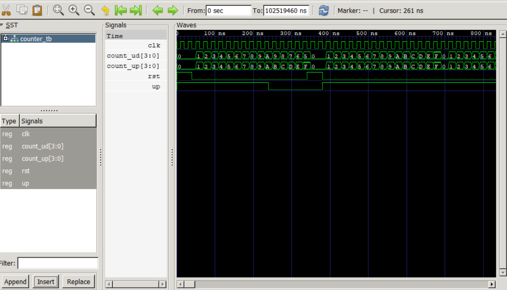

# Lab 8: Implementation and Simulation of Counters Using VHDL

## Objective

The objectives of this lab are:

- To understand the working principle of synchronous binary counters.
- To design and implement a 4-bit synchronous Up Counter using VHDL.
- To design and implement a 4-bit synchronous Up/Down Counter using VHDL.
- To simulate the behavior of both counters using a common testbench.
- To verify the counter outputs through simulation waveforms.

---

# Theory

A **Counter** is a sequential digital circuit that counts clock pulses and changes its output state on each active clock edge. Counters are widely used in digital systems for timing, frequency division, event counting, and address generation.

Unlike combinational circuits, counters have memory elements (flip-flops), allowing them to store the current count value. In this experiment, both counters use a **4-bit unsigned register** and a **synchronous active-high reset**, meaning the counter resets only on the rising edge of the clock when the reset signal is asserted.

### 1. 4-bit Synchronous Up Counter

A synchronous up counter increments its count by one on every rising edge of the clock.

- When **RST = 1**, the counter resets to `0000`.
- When **RST = 0**, the counter increments by one each clock cycle.
- After reaching `1111` (15), it overflows back to `0000`.

---

### 2. 4-bit Synchronous Up/Down Counter

A synchronous up/down counter can either increment or decrement its count depending on the control input **UP**.

- When **RST = 1**, the counter resets to `0000`.
- When **UP = 1**, the counter counts upward.
- When **UP = 0**, the counter counts downward.
- The counter wraps around automatically due to its 4-bit size.

---

# Counter Operations

## Up Counter

| RST | Operation |
|-----|-----------|
| 1 | Reset counter to `0000` |
| 0 | Increment counter by 1 |

---

## Up/Down Counter

| RST | UP | Operation |
|-----|----|-----------|
| 1 | X | Reset counter to `0000` |
| 0 | 1 | Count Up |
| 0 | 0 | Count Down |

---

# Files Included

- `COUNTER_UP.vhd` – 4-bit synchronous Up Counter implementation
- `COUNTER_UPDOWN.vhd` – 4-bit synchronous Up/Down Counter implementation
- `COUNTER_TB.vhd` – Testbench for simulation

---

# Simulation Output
---

---

# Conclusion

In this laboratory experiment, a 4-bit synchronous Up Counter and a 4-bit synchronous Up/Down Counter were successfully implemented using VHDL and verified through simulation. The simulation confirmed that the Up Counter incremented correctly on each rising clock edge, while the Up/Down Counter accurately switched between incrementing and decrementing based on the control input. The synchronous reset function was also verified, ensuring both counters returned to zero when asserted. This experiment provided practical experience in designing, simulating, and analyzing synchronous counter circuits using VHDL.